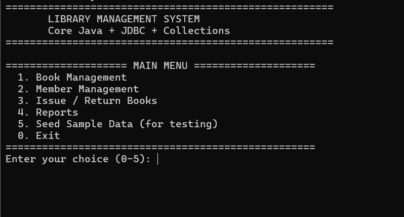
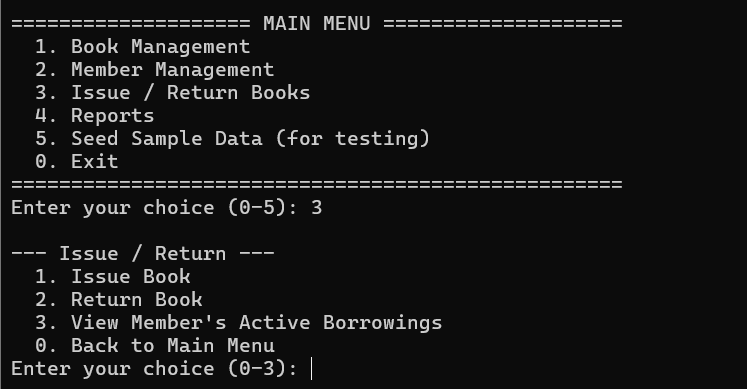
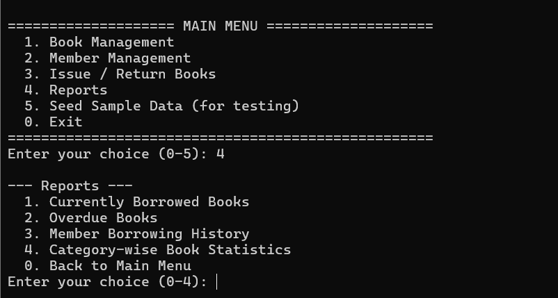

# Library Management System

A terminal-based Library Management System built with **core Java**, the **Collections Framework**, and **JDBC**.  
This project demonstrates Object-Oriented Programming (OOP), database connectivity, and a clean menu-driven console interface.

## Description

This application allows a library to manage books, members, and borrowing/returning activities.  
All data is stored in a SQLite database so it persists between program runs.  
The project follows clean package structure and uses proper exception handling.

## Features

### Core Features
- Add, update, delete, and search **books** (title, author, ISBN, category, copies)
- Register, update, delete, and search **library members**
- **Issue** books to members (prevents issuing when zero copies are available)
- **Return** books and automatically update available copy counts
- Track due dates and identify **overdue** books
- Generate reports:
  - Currently borrowed books
  - Overdue books
  - Member borrowing history
  - Category-wise book statistics
- Input validation and custom exception handling
- Data persists using SQLite database

### Stretch Goals Implemented
- Category-wise statistics report
- Overdue detection with message on return
- Prevent deleting books/members that have active borrowings
- In-memory caching using `HashMap`

## Technologies Used

| Technology       | Details                          |
|------------------|----------------------------------|
| Language         | Java (JDK 11+)                   |
| Database         | SQLite                           |
| JDBC Driver      | sqlite-jdbc-3.36.0.3             |
| Build Tool       | None (plain `javac` / `java`)    |

## Project Structure

```
LibraryManagementSystem/
├── config.properties                 # Database configuration
├── lib/
│   └── sqlite-jdbc-3.36.0.3.jar      # SQLite JDBC driver
├── src/main/java/com/library/
│   ├── Main.java                     # Entry point + menus
│   ├── model/
│   │   ├── Person.java               # Abstract base class
│   │   ├── Member.java               # Extends Person
│   │   ├── Book.java                 # Implements Comparable
│   │   └── Borrowing.java
│   ├── dao/
│   │   ├── BookDAO.java
│   │   ├── MemberDAO.java
│   │   └── BorrowingDAO.java
│   ├── service/
│   │   └── LibraryService.java       # Business logic + Collections
│   ├── util/
│   │   ├── DatabaseConnection.java
│   │   └── InputHelper.java
│   └── exception/
│       └── LibraryException.java     # Custom exception
├── src/main/resources/
│   └── schema.sql                    # Database schema
├── .gitignore
├── run.bat                           # Windows run script
├── run.sh                            # Linux/Mac run script
└── README.md
```

## Database Schema

The database is automatically created on first run.  
Schema file: `src/main/resources/schema.sql`

**Tables:**
- `books` – id, title, author, isbn, category, total_copies, available_copies
- `members` – id, name, email, phone, join_date
- `borrowings` – id, book_id, member_id, issue_date, due_date, return_date, status

## How to Run

### Prerequisites
- JDK 11 or higher installed  
  Check with: `java -version` and `javac -version`

### Windows (Command Prompt)

```cmd
cd LibraryManagementSystem
mkdir bin
dir /s /b src\main\java\*.java > sources.txt
javac -encoding UTF-8 -cp "lib\*" -d bin @sources.txt
java -cp "bin;lib\*" com.library.Main
```

Or simply double-click / run:

```cmd
run.bat
```

### Windows (PowerShell)

```powershell
cd LibraryManagementSystem
mkdir bin -Force
javac -encoding UTF-8 -cp "lib\*" -d bin (Get-ChildItem -Recurse -Filter *.java src\main\java).FullName
java -cp "bin;lib\*" com.library.Main
```

### Linux / Mac

```bash
cd LibraryManagementSystem
mkdir -p bin
javac -encoding UTF-8 -cp "lib/*" -d bin $(find src/main/java -name "*.java")
java -cp "bin:lib/*" com.library.Main
```

Or:

```bash
./run.sh
```

### First Run Tip
After the menu appears, choose option **5** to load sample books and members.  
Then you can test Issue/Return and Reports.

## Design Highlights (Assignment Requirements)

| Requirement                    | How it is implemented                              |
|--------------------------------|----------------------------------------------------|
| Abstract class / Interface     | `Person` (abstract) extended by `Member`           |
| Encapsulation                  | Private fields + getters/setters on all models     |
| Polymorphism                   | `getDisplayInfo()` overridden in `Member`          |
| 4–5+ classes beyond Main       | 12 classes total                                   |
| List (ArrayList)               | Used in DAOs and service layer                     |
| Map (HashMap / TreeMap)        | Caching + category statistics                      |
| Sorting / Filtering            | `Comparable`, `Comparator`, streams                |
| JDBC + PreparedStatement       | All queries use PreparedStatement                  |
| Full CRUD                      | Books, Members, Borrowings                         |
| try-with-resources             | Used for Connection, Statement, ResultSet          |
| Custom exception               | `LibraryException`                                 |
| Menu-driven + validation       | `InputHelper` + Scanner                            |
| Credentials not hard-coded     | `config.properties` + `.gitignore`                 |

## Known Limitations
- Fine calculation for overdue books is not implemented
- No reservation / waitlist feature
- Single-user console application

## Screenshots


```





```

